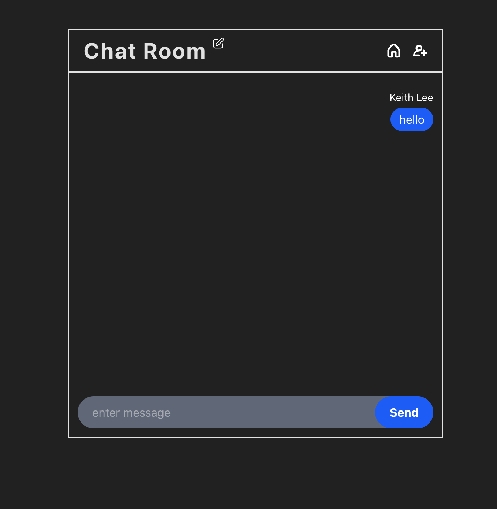

<h1 align="center">Chat Room</h1>
<p align="center">
  
  
  
  
  
  
</p>



<h2>
<a href="[https://your-demo-link.com](https://side-project-chat-room.vercel.app/)">
  Demo Here
</a>
</h2>

---

## 📄 Description

This project is a **real-time chat room** built with **Vue 3**, **Vite**, and **Firebase**. It uses TailwindCSS for styling and supports user authentication and real-time message updates through Firebase Firestore.

## 📋 Project Structure

1. **Chat Room:** Users can enter different rooms and chat in real-time.
2. **User Authentication:** Users can log in with Google via Firebase Authentication.
3. **Message Storage:** Messages are stored in Firebase Firestore and updated in real-time.
4. **Responsive Design:** The UI is built with Tailwind CSS for a smooth user experience.
5. **Invite Friends:** Users can generate invite links to share with others.

## 🚀 Features

- Built with **Vue 3** and **Vite** for modern web performance.
- Styled using **Tailwind CSS** for a sleek UI.
- Integrated with **Firebase** for real-time chat updates.
- Users can copy an **invite link** to share chat rooms.
- No backend setup required—**everything runs on Firebase**.

## 📦 Setup & Development Server

1. Clone this repository:
   ```sh
   git clone https://github.com/your-repo/side-project-chat_room.git
   cd side-project-chat_room
